# Operationalize Machine Learning
In this project, we will continue to work with the Bank Marketing datase. We will use Azure to automatically train a machine learning model using AutoML, deploy it with the Azure ML Studio, and consume it through the REST endpoint generated by Azure. 
Automation is critical when launching a project to production, this is why we will also automate the entire workflow shown before via a Pipeline. We will see how to create, publish, and consume a pipeline. In the end, a screencast video will showcase the end-to-end process.
## Architectural Diagram


- Step 1: Authentication
This step is required if the project is hosted on a personal Azure account. We will use the Azure Machine Learning Extension to interact with Azure Machine Learning Studio.

- Step 2: Automated ML Experiment
In this step, we will create an experiment using Automated ML, configure a compute cluster, and use that cluster to run the experiment.

- Step 3: Deploy the best model
Once the experiment run completes, a summary of all the models and their metrics are shown, including explanations. The Best Model will be shown in the Details tab and we will select it to deploy. Deploying the Best Model will allow to interact with the HTTP API service and interact with the model by sending data over POST requests.

- Step 4: Enable logging
Once the Best Model is deployed, we have to enable Application Insights and retrieve logs.

- Step 5: Swagger Documentation
In this step, we will consume the deployed model using Swagger using the provided Swagger JSON file for deployed models from Azure.

- Step 6: Consume model endpoints
Once the model is deployed, we can use the endpoint.py script provided to interact with the trained model.

- Step 7: Create and Publish a Pipeline
For this part of the project, we will use the Jupyter Notebook provided in the starter files. All in one Notebook, we will: 
  1. Create an Experiment in an existing Workspace. 
  2. Create or Attach existing AmlCompute to a workspace. 
  3. Define data loading in a TabularDataset. 
  4. Configure AutoML using AutoMLConfig. 
  5. Use AutoMLStep.
  6. Train the model using AmlCompute.
  7. Explore the results. 
  8. Test the best fitted model.
  9. Publish the pipeline and run from REST endpoint.

- Step 8: Documentation
  The Screencast of the entire process is available [here](#screen-recording).

## Key Steps

1. Authentication to the Azure account. The commands were run:
```bash
az login
az extension add -n azure-cli-ml

#create a Service Principal in azure active directory named {ml-auth}

az ad sp create-for-rbac --sdk-auth --name {ml-auth}

#from the previous run, copy the clientId and run 

az ad sp show --id {clientId}

#from the previous run, copy the objectId and run (-w is the machine learning workspace and -g is the resource group )

az ml workspace share -w udacity-ml-workspace -g NetworkWatcherRG --user {objectId} --role owner
```
   
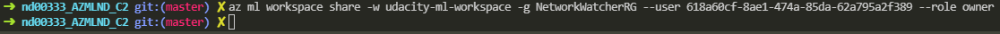

### 1. Automated ML Experiment. 
This step will allow us to automatically train a model directly from the dataset. AutoML will automatically parse the dataset, do hyperparameter tuning and test differents algorithms to find most performant one.
   1. Create a new compute cluster
   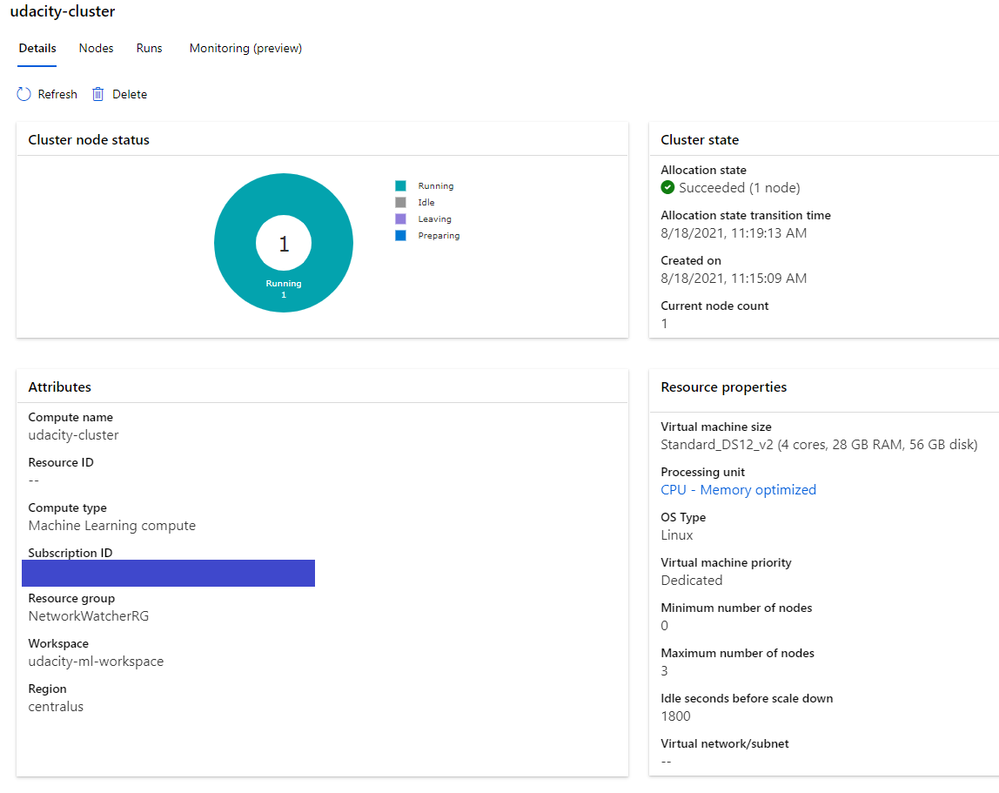
   1. Upload the telemarketing data.
   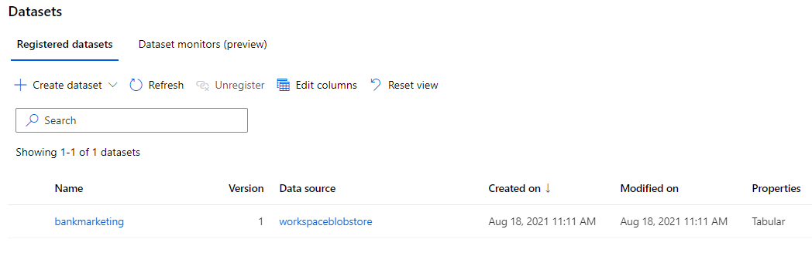
   1. Create a new automated ML run using the bank marketing dataset
   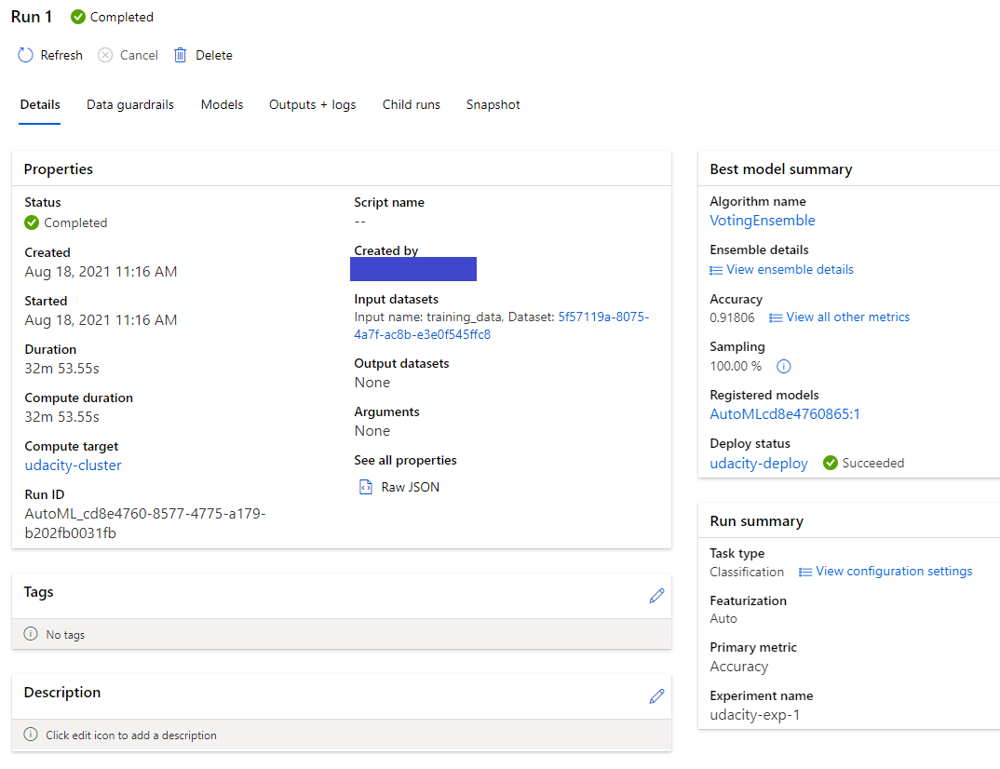
### 2. Deploy the Best Model. 
This step will allow us to interact with the best model by sending requests to the REST endoint. In this case, we chose the VotingEnsemble model with 91.81% accuracy. 

   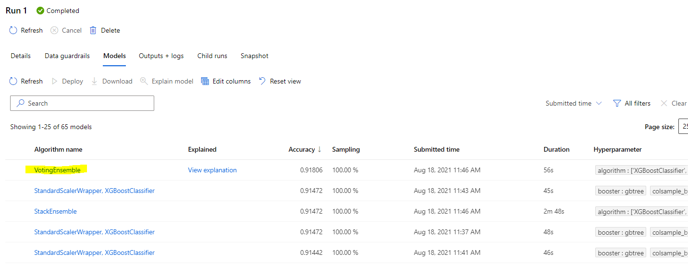

   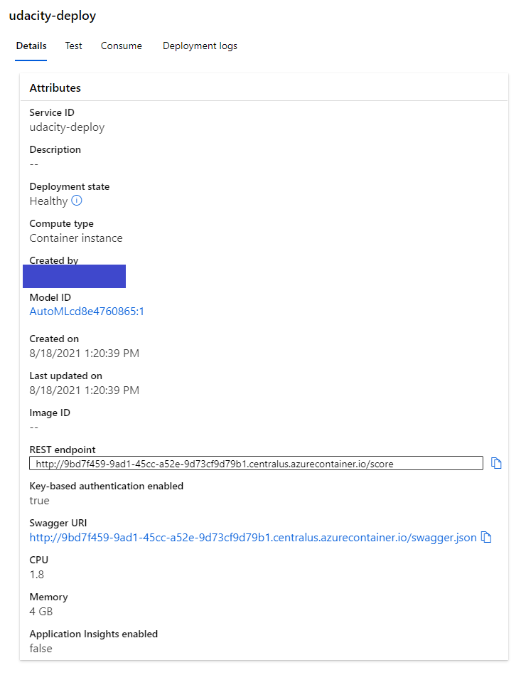
### 3. Enable Application Insights. 
This step will allow us to retrieve logs from the deployed model. By enabling Application Insights, we can use this performance management service allowing us to do monitoring.
   1. Install Azure python SDK : `pip install az`
   2. Create a new virtual env with Python3
   3. Enable Application Insights in the `logs.py` file: `service.update(enable_app_insights=True)`
   4. Application Insight enabled
   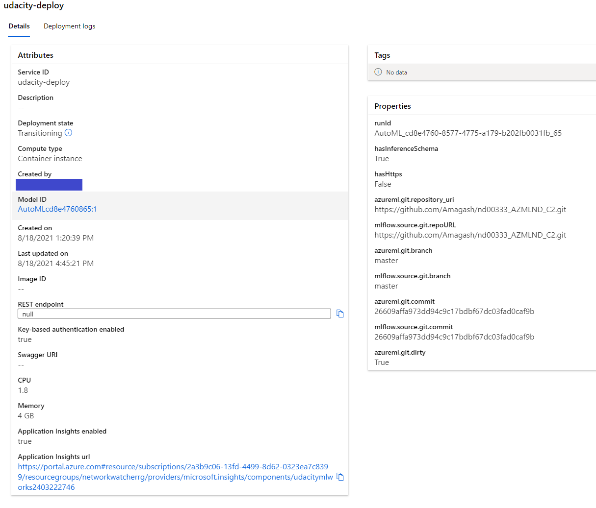
   1. Check the logs
   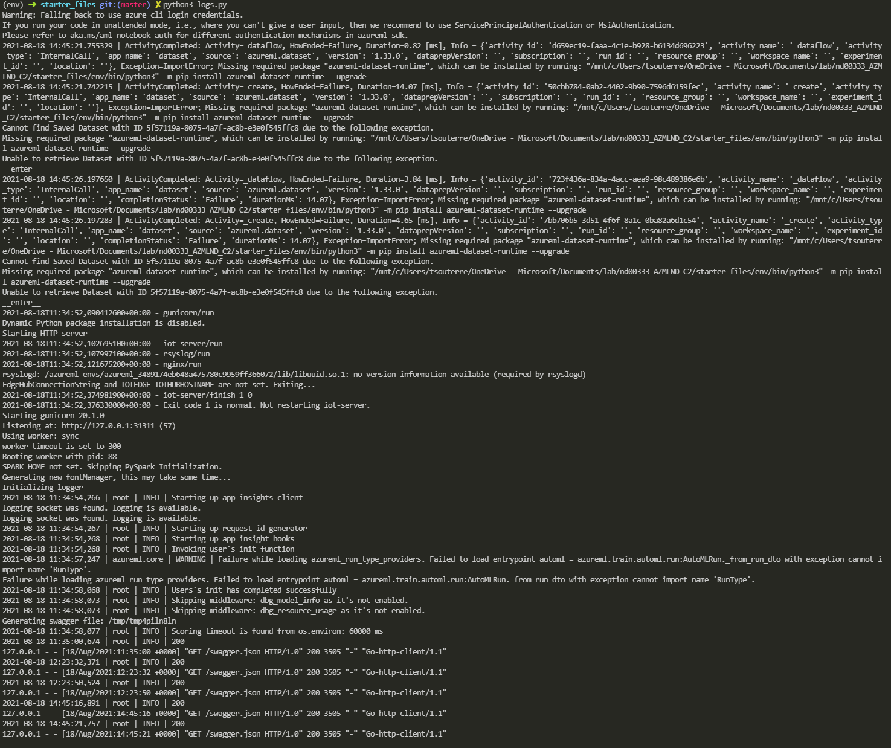
### 4. Swagger Documentation. 
This step allows us to use swagger, a tool that help build, document and consume the REST endpoint we just deployed through and extensive and well explained documentation.
   1. Download the swagger.json file in `swagger/swagger.json`
   2. Run the swagger.sh and serve
   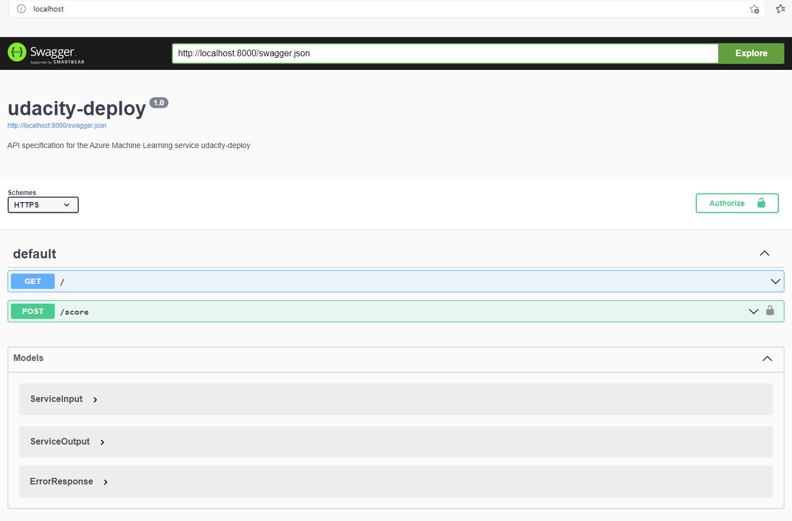
### 5. Consume Model Endpoints. 
This step will allow us to consume a deployed service via the API. Once the model is deployed, Azure automatically generates a REST endpoint from which we can consume the model and a key to secure the access to the endpoint.
   1. Modify the `scoring_uri` and the `key` in the `endpoints.py` file.
   2. Check if the script runs successfuly against the API producing the right JSON output `{"result": ["yes", "no"]}`
   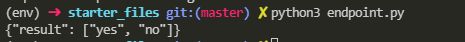
   1. Modify the `scoring_uri` and the `key` in the `benchmark.sh` file and run the benchmark.
   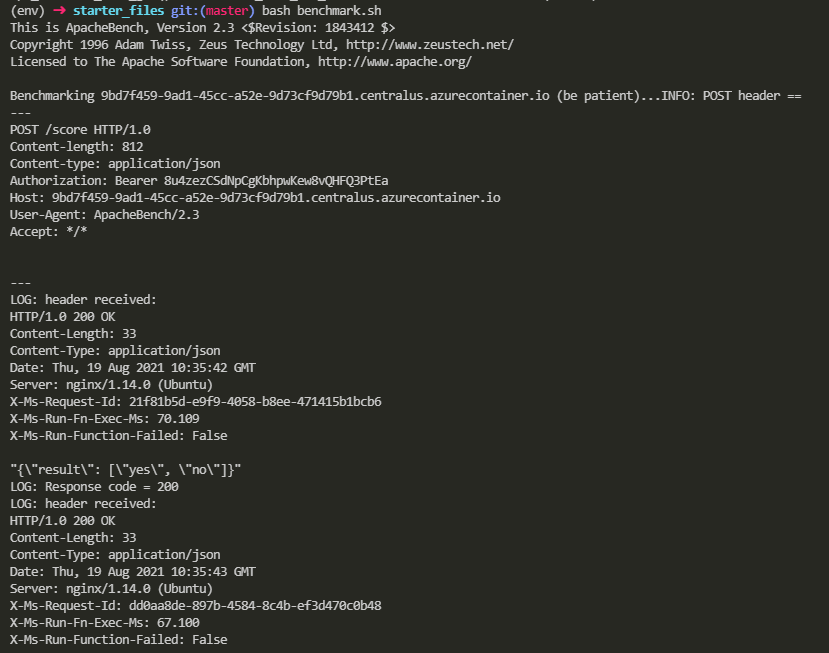
   ...
   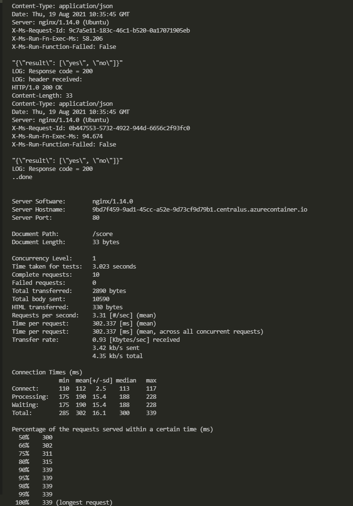
   
   Here the benchmark is acceptable because there are 0 failed requests, and each request is very fast with only 3.31 requests per second.
### 6. Create and Publish Pipeline
This step will allow us to automate all the previous steps in a pipeline. This is crtical for production deployment as it make the environment more productive, resilient and scalable.
   1. Upload the Notebook and update variables.
   2. Create the pipeline
   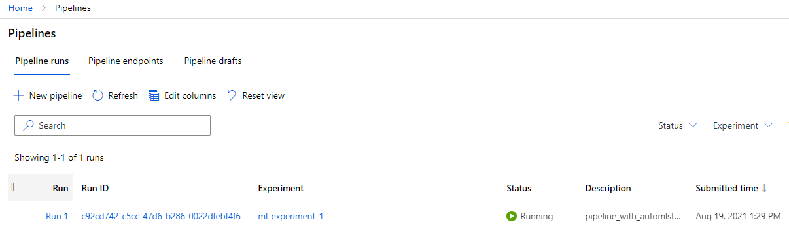
   1. Pipeline endpoint
   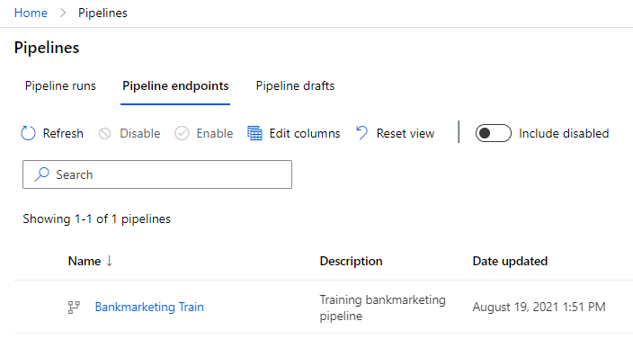
   1. Bankmarketing dataset
   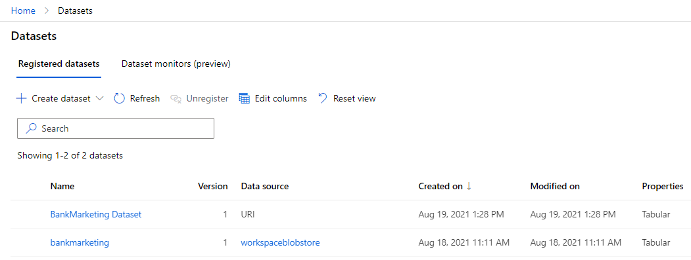
   1. Published pipeline overview
   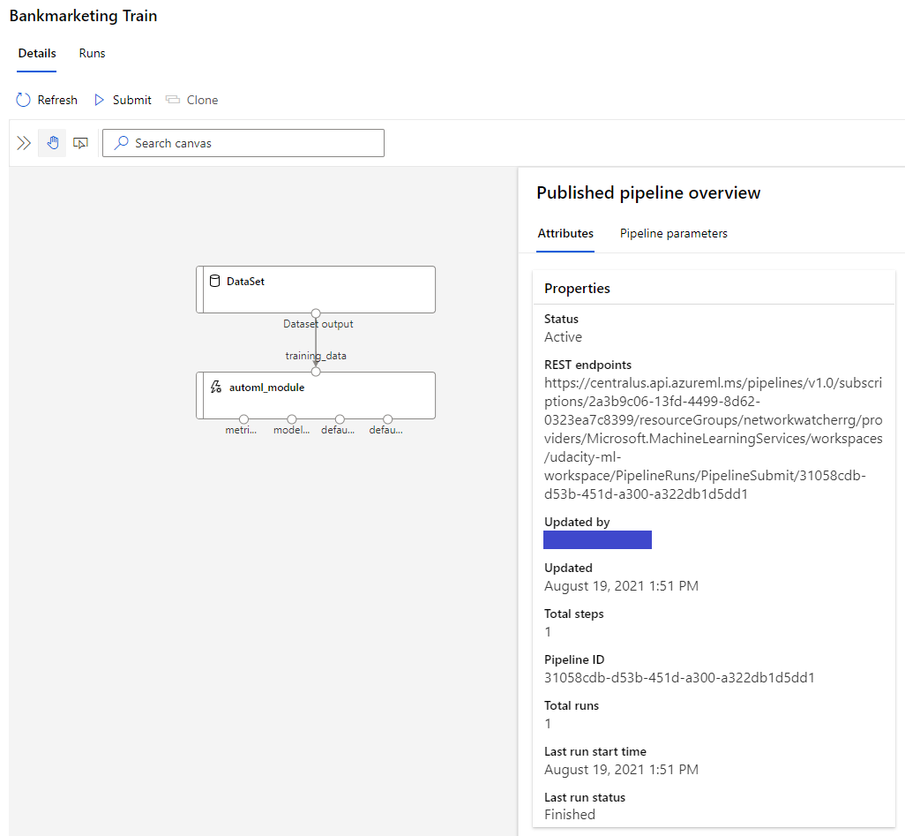
   1. RunDetails Widget
   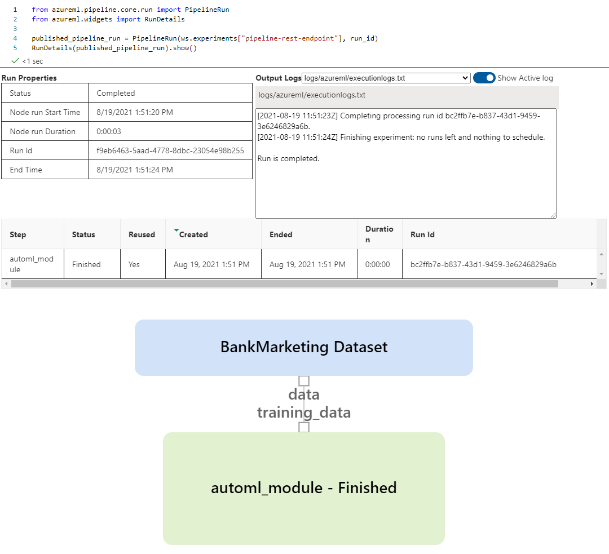
   1. The run
   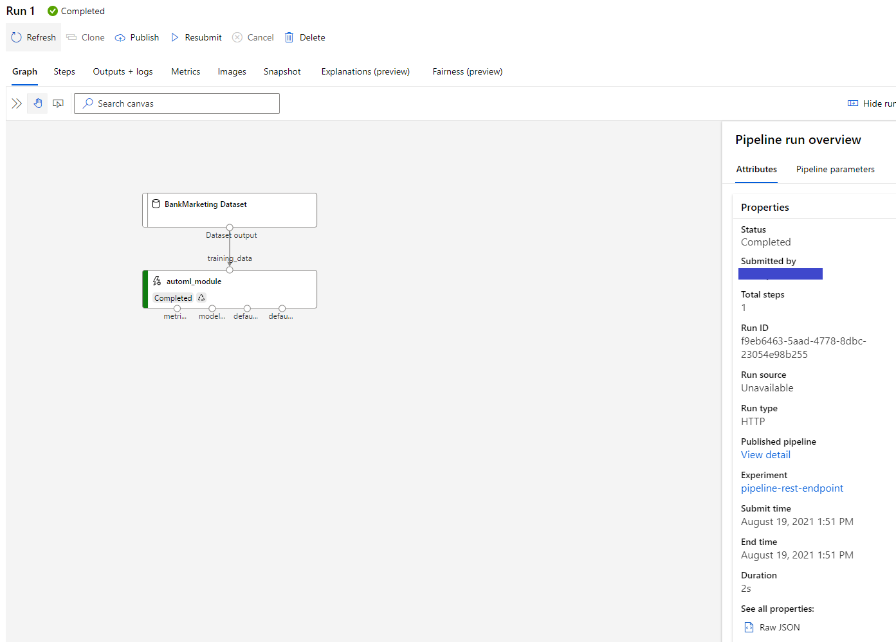
## Screen Recording

Here is a screen recording of the project in action: https://youtu.be/9lau8phreIw

## Future Work

One flag was raised during the AutoML run as shown in the image below.

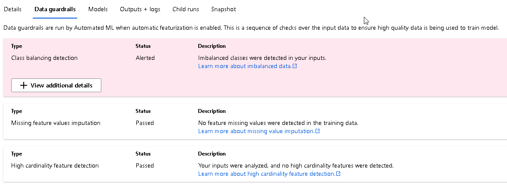

It is noticed that there are imbalanced classes in the input. The algorithms used by automated ML detect imbalance when the number of samples in the minority class is equal to or fewer than 20% of the number of samples in the majority class, where minority class refers to the one with fewest samples and majority class refers to the one with most samples.

This imbalance can be handled by using technique like **Synthetic Minority Oversampling Technique** (SMOTE) during the data preparation step. It could be interesting to preprocess the data with SMOTE in futur work.