*NOTE:* This file is a template that you can use to create the README for your project. The *TODO* comments below will highlight the information you should be sure to include.

# Your Project Title Here

*TODO:* Write an overview to your project.

## Architectural Diagram
*TODO*: Provide an architectual diagram of the project and give an introduction of each step. An architectural diagram is an image that helps visualize the flow of operations from start to finish. In this case, it has to be related to the completed project, with its various stages that are critical to the overall flow. For example, one stage for managing models could be "using Automated ML to determine the best model". 

Step 1: Authentication
This step is required if the project is hosted on a personal Azure account.

Step 2: Automated ML Experiment

## Key Steps
*TODO*: Write a short discription of the key steps. Remeber to include all the screenshots required to demonstrate key steps. 

1. Authentication to the Azure account. Run the following command 
   
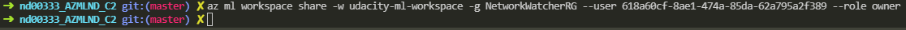

2. Automated ML Experiment
   1. Create a new compute cluster
   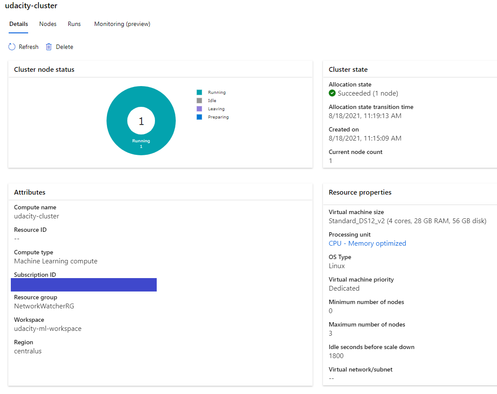
   2. Upload the telemarketing data.
   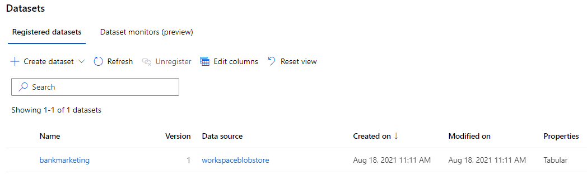
   3. Create a new automated ML run using the bank marketing dataset
   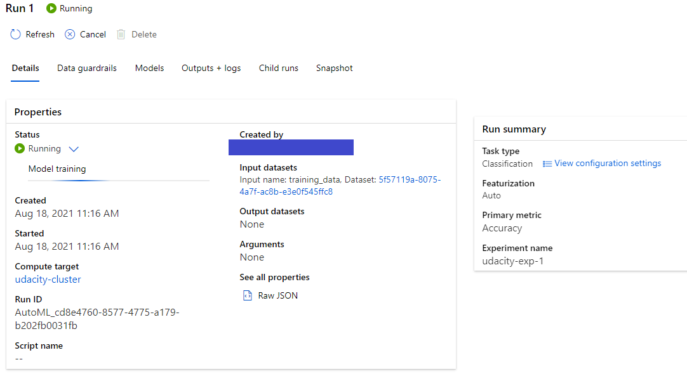
3. Deploy the Best Model. In this case, we chose the VotingEnsemble model with 91.81% accuracy.

   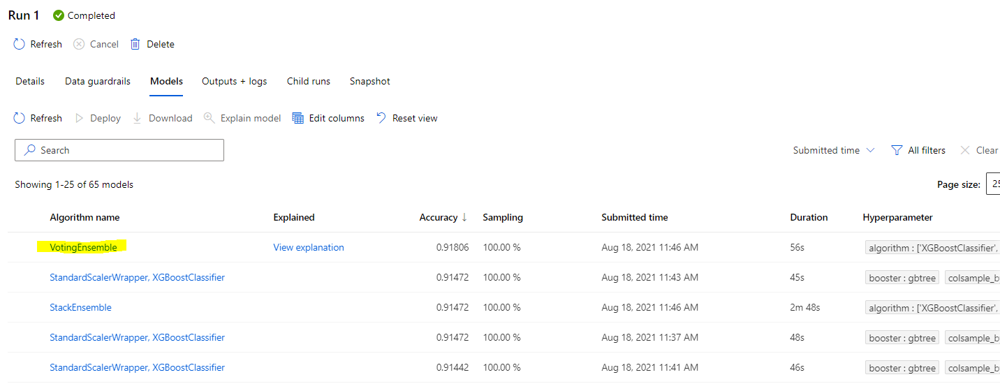

   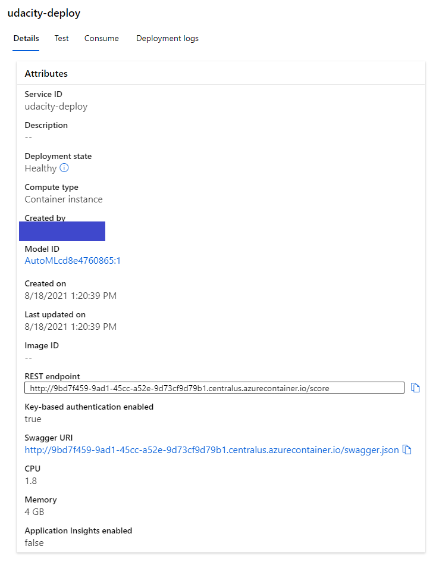
4. Enable Application Insights
   1. Install Azure python SDK : `pip install az`
   2. Create a new virtual env with Python3
   3. Enable Application Insights in the `logs.py` file: `service.update(enable_app_insights=True)`
   4. Application Insight enabled
   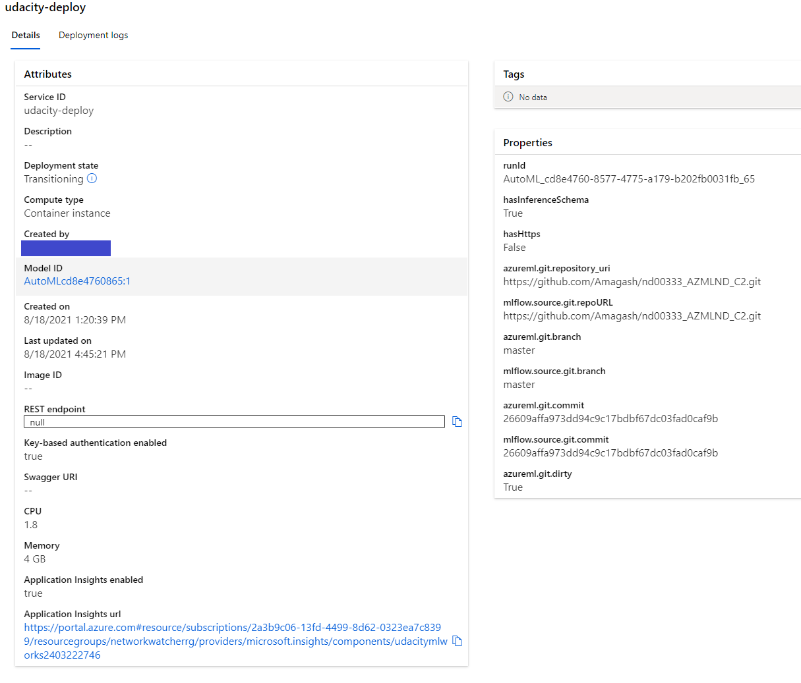
   5. Check the logs
   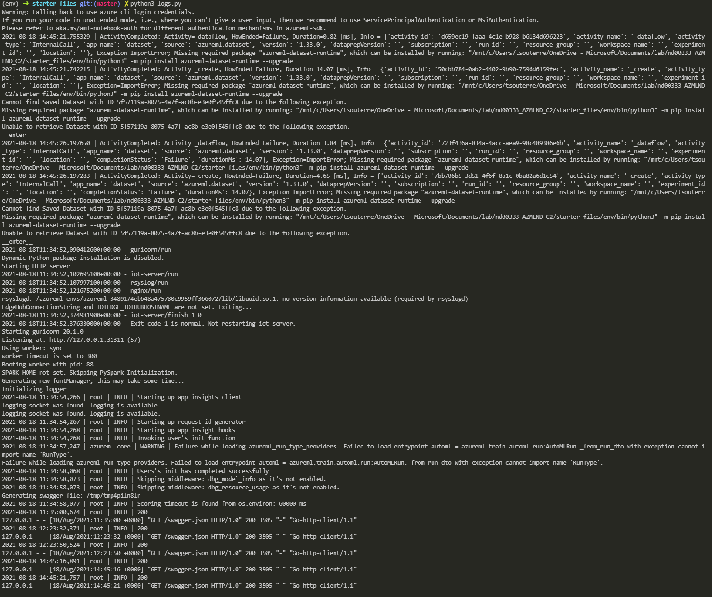
5. Swagger Documentation
   1. Download the swagger.json file in `swagger/swagger.json`
   2. Run the swagger.sh and serve
   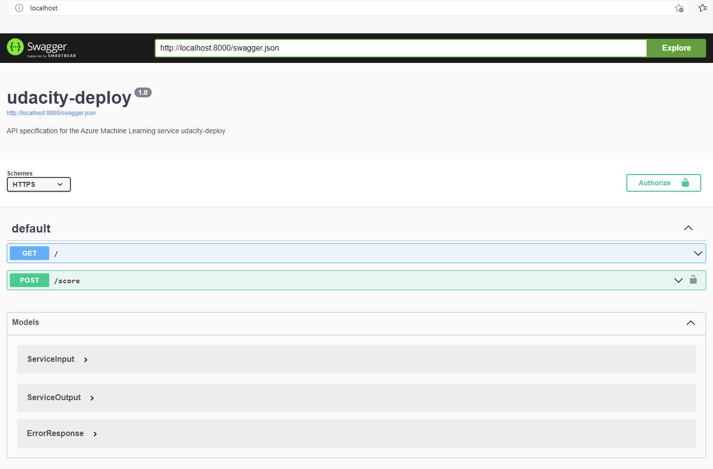
6. Consume Model Endpoints
   1. Modify the `scoring_uri` and the `key` in the `endpoints.py` file.
   2. Check if the script runs successfuly against the API producing the right JSON output `{"result": ["yes", "no"]}`
   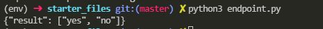
   3. Modify the `scoring_uri` and the `key` in the `benchmark.sh` file and run the benchmark.
   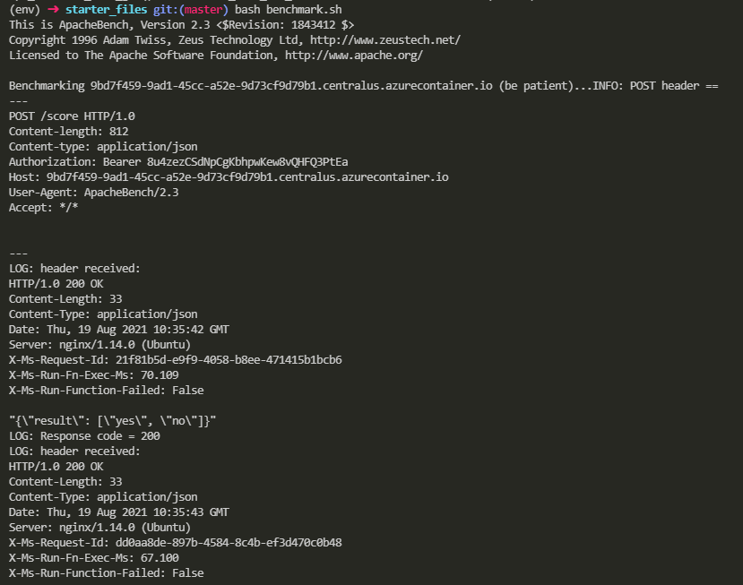
   ...
   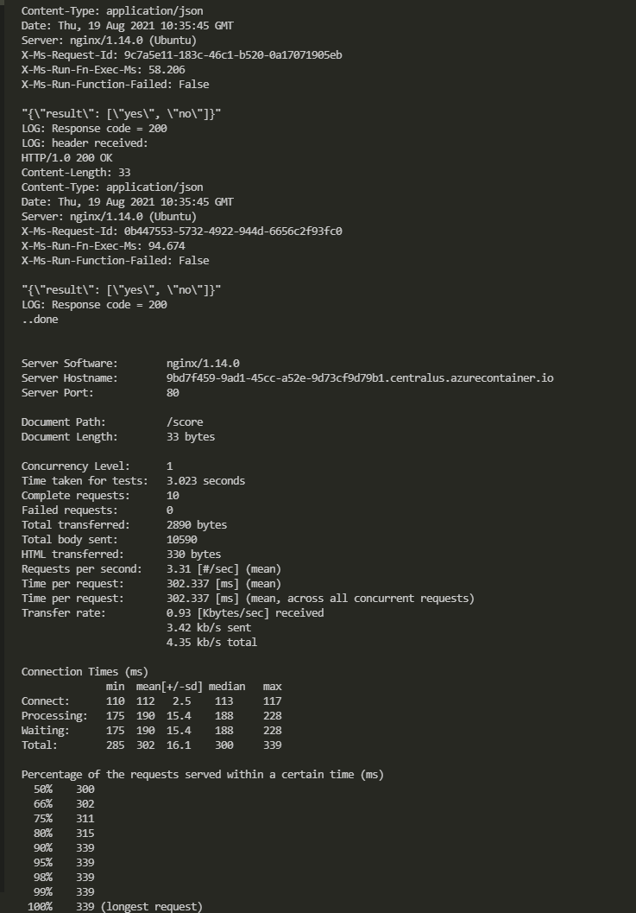
   Here the benchmark is acceptable because there are 0 failed requests, and each request is very fast with only 3.31 requests per second.
## Screen Recording
*TODO* Provide a link to a screen recording of the project in action. Remember that the screencast should demonstrate:

## Standout Suggestions
*TODO (Optional):* This is where you can provide information about any standout suggestions that you have attempted.
 test