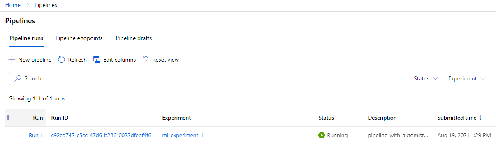
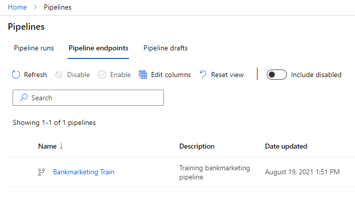
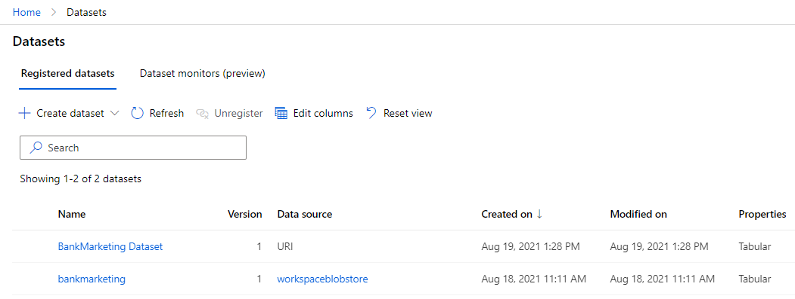
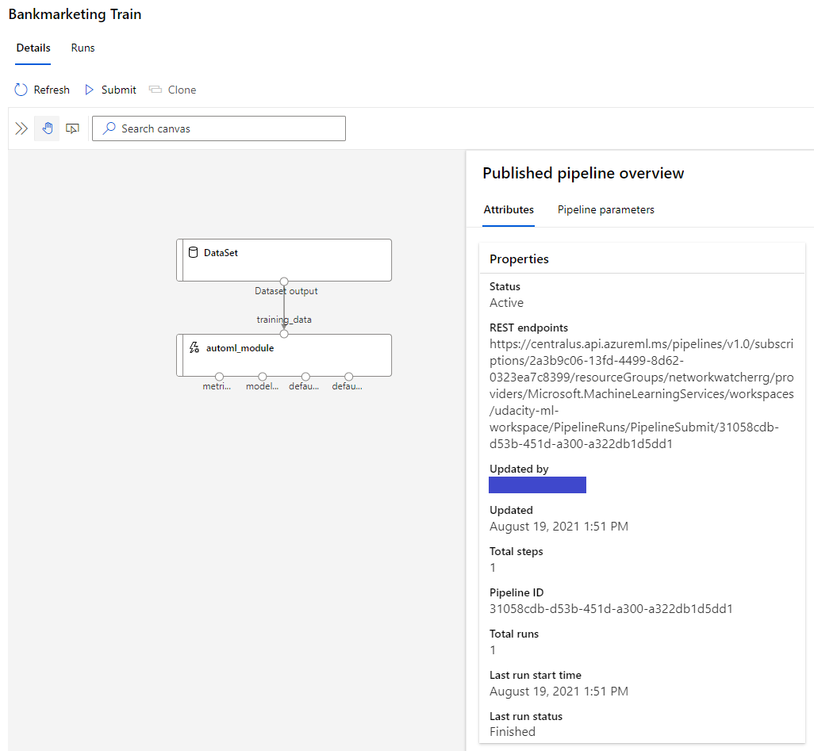
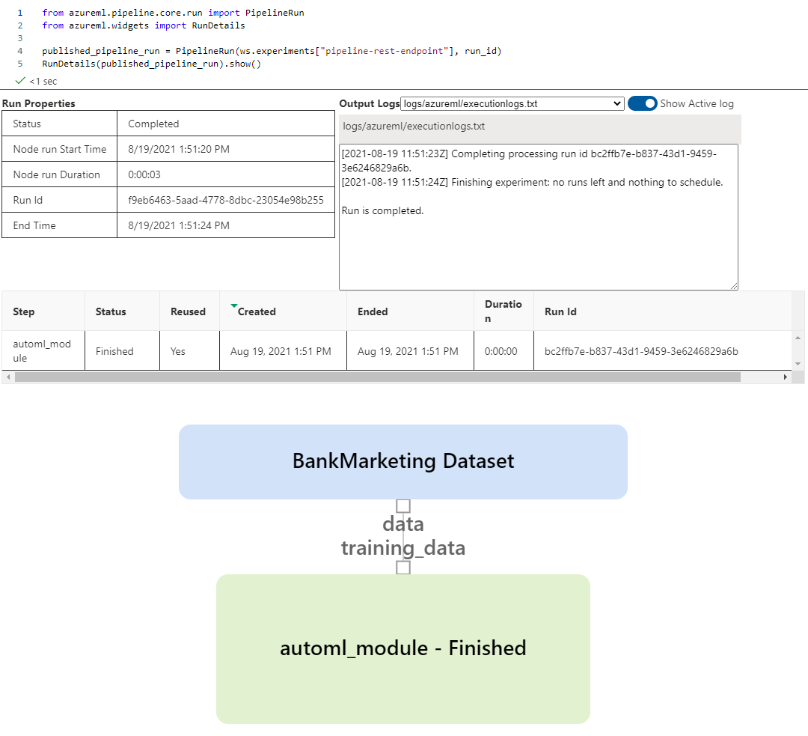

# Operationalize Machine Learning
In this project, we will continue to work with the Bank Marketing datase. We will use Azure to configure a cloud-based machine learning production model, deploy it, and consume it. We will also create, publish, and consume a pipeline. In the end, a screencast video will showcase the end-to-end process.
## Architectural Diagram

- Step 1: Authentication
This step is required if the project is hosted on a personal Azure account. We will use the Azure Machine Learning Extension to interact with Azure Machine Learning Studio.

- Step 2: Automated ML Experiment
In this step, we will create an experiment using Automated ML, configure a compute cluster, and use that cluster to run the experiment.

- Step 3: Deploy the best model
Once the experiment run completes, a summary of all the models and their metrics are shown, including explanations. The Best Model will be shown in the Details tab and we will select it to deploy. Deploying the Best Model will allow to interact with the HTTP API service and interact with the model by sending data over POST requests.

- Step 4: Enable logging
Once the Best Model is deployed, we have to enable Application Insights and retrieve logs.

- Step 5: Swagger Documentation
In this step, we will consume the deployed model using Swagger using the provided Swagger JSON file for deployed models from Azure.

- Step 6: Consume model endpoints
Once the model is deployed, we can use the endpoint.py script provided to interact with the trained model.

- Step 7: Create and Publish a Pipeline
For this part of the project, we will use the Jupyter Notebook provided in the starter files. All in one Notebook, we will: 
  1. Create an Experiment in an existing Workspace. 
  2. Create or Attach existing AmlCompute to a workspace. 
  3. Define data loading in a TabularDataset. 
  4. Configure AutoML using AutoMLConfig. 
  5. Use AutoMLStep.
  6. Train the model using AmlCompute.
  7. Explore the results. 
  8. Test the best fitted model.
  9. Publish the pipeline and run from REST endpoint.

- Step 8: Documentation
  The Screencast of the entire process is available [here](#screen-recording).

## Key Steps

1. Authentication to the Azure account. Run the following command 
   

2. Automated ML Experiment
   1. Create a new compute cluster
   
   2. Upload the telemarketing data.
   
   3. Create a new automated ML run using the bank marketing dataset
   
3. Deploy the Best Model. In this case, we chose the VotingEnsemble model with 91.81% accuracy.

   

   
4. Enable Application Insights
   1. Install Azure python SDK : `pip install az`
   2. Create a new virtual env with Python3
   3. Enable Application Insights in the `logs.py` file: `service.update(enable_app_insights=True)`
   4. Application Insight enabled
   
   5. Check the logs
   
5. Swagger Documentation
   1. Download the swagger.json file in `swagger/swagger.json`
   2. Run the swagger.sh and serve
   
6. Consume Model Endpoints
   1. Modify the `scoring_uri` and the `key` in the `endpoints.py` file.
   2. Check if the script runs successfuly against the API producing the right JSON output `{"result": ["yes", "no"]}`
   
   3. Modify the `scoring_uri` and the `key` in the `benchmark.sh` file and run the benchmark.
   
   ...
   
   Here the benchmark is acceptable because there are 0 failed requests, and each request is very fast with only 3.31 requests per second.
7. Create, Publish and Consume a Pipeline
   1. Upload the Notebook and update variables.
   2. Create the pipeline
   
   3. Pipeline endpoint
   
   4. Bankmarketing dataset
   
   5. Published pipeline overview
   
   6. RunDetails Widget
   
   7. The run
   
## Screen Recording
*TODO* Provide a link to a screen recording of the project in action. Remember that the screencast should demonstrate:

